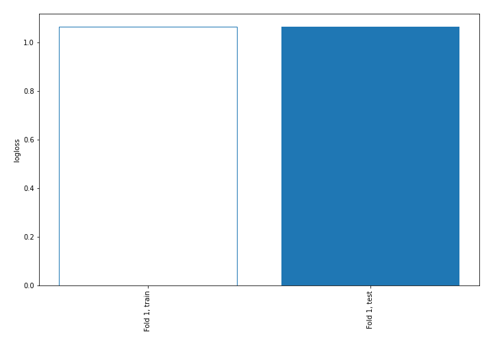
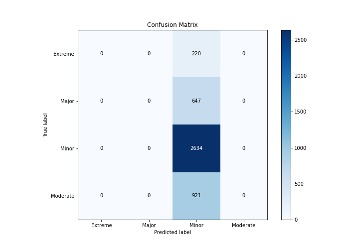
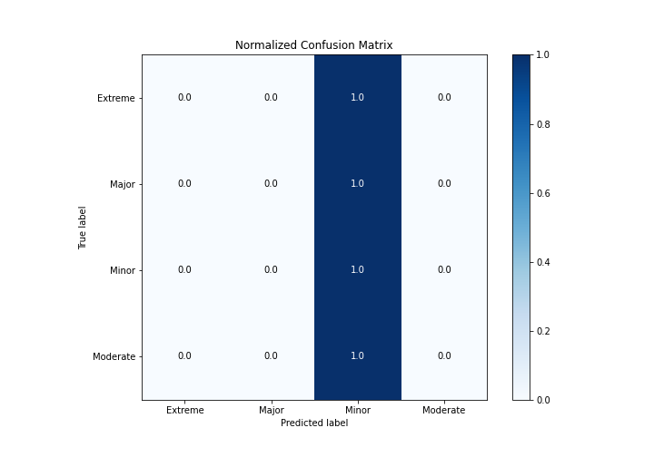
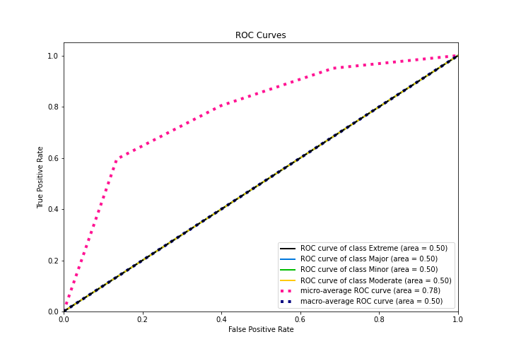
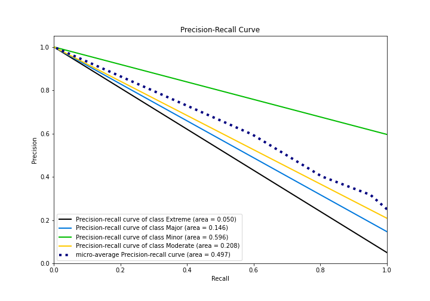

# Summary of 1_Baseline

[<< Go back](../README.md)

## Baseline Classifier (Baseline)
- **n_jobs**: -1
- **num_class**: 4
- **explain_level**: 2

## Validation
 - **validation_type**: split
 - **train_ratio**: 0.75
 - **shuffle**: True
 - **stratify**: True

## Optimized metric
logloss

## Training time

1.0 seconds

### Metric details
|           |   Extreme |   Major |       Minor |   Moderate |   accuracy |   macro avg |   weighted avg |   logloss |
|:----------|----------:|--------:|------------:|-----------:|-----------:|------------:|---------------:|----------:|
| precision |         0 |       0 |    0.595658 |          0 |   0.595658 |    0.148915 |       0.354809 |   1.06587 |
| recall    |         0 |       0 |    1        |          0 |   0.595658 |    0.25     |       0.595658 |   1.06587 |
| f1-score  |         0 |       0 |    0.746599 |          0 |   0.595658 |    0.18665  |       0.444718 |   1.06587 |
| support   |       220 |     647 | 2634        |        921 |   0.595658 | 4422        |    4422        |   1.06587 |

## Confusion matrix
|                     |   Predicted as Extreme |   Predicted as Major |   Predicted as Minor |   Predicted as Moderate |
|:--------------------|-----------------------:|---------------------:|---------------------:|------------------------:|
| Labeled as Extreme  |                      0 |                    0 |                  220 |                       0 |
| Labeled as Major    |                      0 |                    0 |                  647 |                       0 |
| Labeled as Minor    |                      0 |                    0 |                 2634 |                       0 |
| Labeled as Moderate |                      0 |                    0 |                  921 |                       0 |

## Learning curves

## Confusion Matrix

## Normalized Confusion Matrix

## ROC Curve

## Precision Recall Curve

[<< Go back](../README.md)
