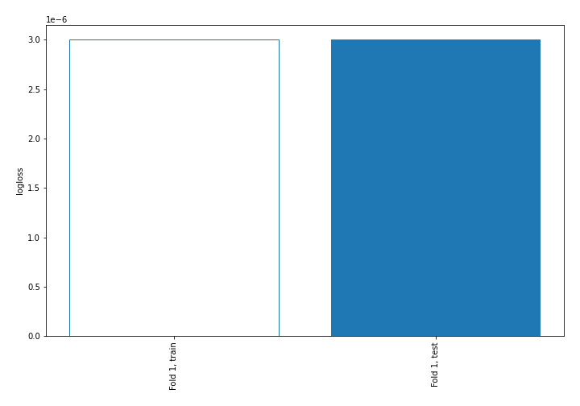

# Summary of 2_DecisionTree

[<< Go back](../README.md)

## Decision Tree
- **n_jobs**: -1
- **criterion**: gini
- **max_depth**: 3
- **num_class**: 4
- **explain_level**: 2

## Validation
 - **validation_type**: split
 - **train_ratio**: 0.75
 - **shuffle**: True
 - **stratify**: True

## Optimized metric
logloss

## Training time

18.4 seconds

### Metric details
|           |   Extreme |   Major |   Minor |   Moderate |   accuracy |   macro avg |   weighted avg |   logloss |
|:----------|----------:|--------:|--------:|-----------:|-----------:|------------:|---------------:|----------:|
| precision |         1 |       1 |       1 |          1 |          1 |           1 |              1 |     3e-06 |
| recall    |         1 |       1 |       1 |          1 |          1 |           1 |              1 |     3e-06 |
| f1-score  |         1 |       1 |       1 |          1 |          1 |           1 |              1 |     3e-06 |
| support   |       220 |     647 |    2634 |        921 |          1 |        4422 |           4422 |     3e-06 |

## Confusion matrix
|                     |   Predicted as Extreme |   Predicted as Major |   Predicted as Minor |   Predicted as Moderate |
|:--------------------|-----------------------:|---------------------:|---------------------:|------------------------:|
| Labeled as Extreme  |                    220 |                    0 |                    0 |                       0 |
| Labeled as Major    |                      0 |                  647 |                    0 |                       0 |
| Labeled as Minor    |                      0 |                    0 |                 2634 |                       0 |
| Labeled as Moderate |                      0 |                    0 |                    0 |                     921 |

## Learning curves

## Decision Tree 

### Tree #1

### Rules

if (APR Risk of Mortality <= 2.5) and (APR Risk of Mortality > 1.5) then class: Minor (proba: 100.0%) | based on 7,899 samples

if (APR Risk of Mortality > 2.5) then class: Moderate (proba: 100.0%) | based on 2,764 samples

if (APR Risk of Mortality <= 2.5) and (APR Risk of Mortality <= 1.5) and (APR Risk of Mortality > 0.5) then class: Major (proba: 100.0%) | based on 1,942 samples

if (APR Risk of Mortality <= 2.5) and (APR Risk of Mortality <= 1.5) and (APR Risk of Mortality <= 0.5) then class: Extreme (proba: 100.0%) | based on 658 samples

## Permutation-based Importance

## Confusion Matrix

## Normalized Confusion Matrix

## ROC Curve

## Precision Recall Curve

## SHAP Importance

## SHAP Dependence plots

### Dependence Extreme (Fold 1)

### Dependence Major (Fold 1)

### Dependence Minor (Fold 1)

### Dependence Moderate (Fold 1)

## SHAP Decision plots

### Worst decisions for selected sample 1 (Fold 1)

### Worst decisions for selected sample 2 (Fold 1)

### Worst decisions for selected sample 3 (Fold 1)

### Worst decisions for selected sample 4 (Fold 1)

### Best decisions for selected sample 1 (Fold 1)

### Best decisions for selected sample 2 (Fold 1)

### Best decisions for selected sample 3 (Fold 1)

### Best decisions for selected sample 4 (Fold 1)

[<< Go back](../README.md)
