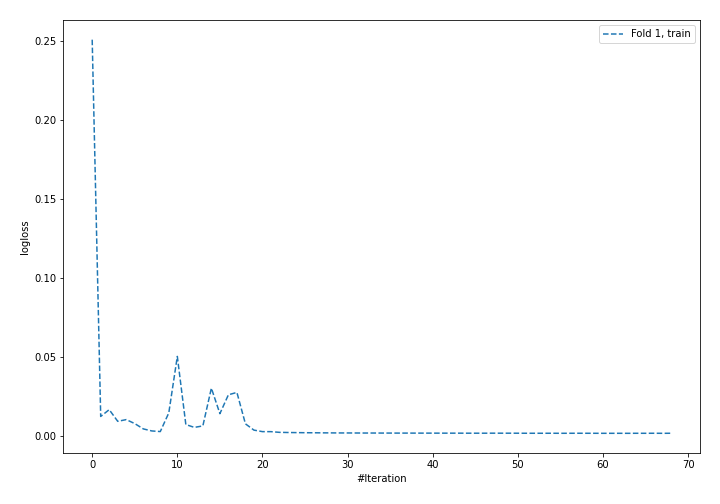
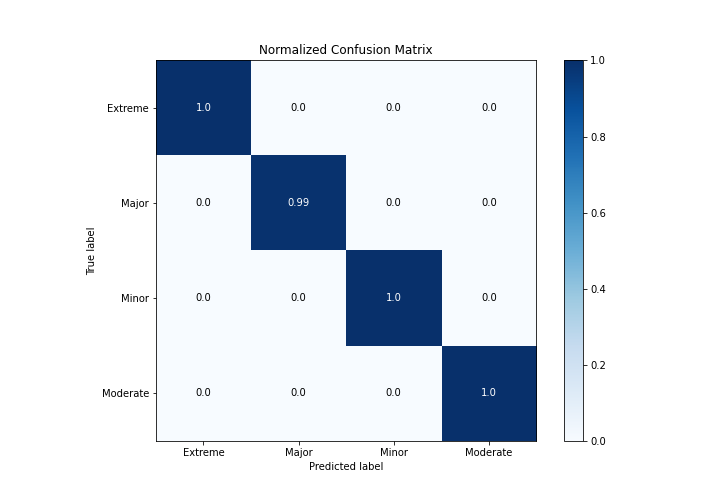

# Summary of 4_Default_NeuralNetwork

[<< Go back](../README.md)

## Neural Network
- **n_jobs**: -1
- **dense_1_size**: 32
- **dense_2_size**: 16
- **learning_rate**: 0.05
- **num_class**: 4
- **explain_level**: 2

## Validation
 - **validation_type**: split
 - **train_ratio**: 0.75
 - **shuffle**: True
 - **stratify**: True

## Optimized metric
logloss

## Training time

8.8 seconds

### Metric details
|           |    Extreme |      Major |       Minor |   Moderate |   accuracy |   macro avg |   weighted avg |    logloss |
|:----------|-----------:|-----------:|------------:|-----------:|-----------:|------------:|---------------:|-----------:|
| precision |   0.986547 |   1        |    0.998862 |   0.998914 |   0.998417 |    0.996081 |       0.998427 | 0.00871767 |
| recall    |   1        |   0.992272 |    0.99962  |   0.998914 |   0.998417 |    0.997702 |       0.998417 | 0.00871767 |
| f1-score  |   0.993228 |   0.996121 |    0.999241 |   0.998914 |   0.998417 |    0.996876 |       0.998417 | 0.00871767 |
| support   | 220        | 647        | 2634        | 921        |   0.998417 | 4422        |    4422        | 0.00871767 |

## Confusion matrix
|                     |   Predicted as Extreme |   Predicted as Major |   Predicted as Minor |   Predicted as Moderate |
|:--------------------|-----------------------:|---------------------:|---------------------:|------------------------:|
| Labeled as Extreme  |                    220 |                    0 |                    0 |                       0 |
| Labeled as Major    |                      3 |                  642 |                    2 |                       0 |
| Labeled as Minor    |                      0 |                    0 |                 2633 |                       1 |
| Labeled as Moderate |                      0 |                    0 |                    1 |                     920 |

## Learning curves

## Permutation-based Importance

## Confusion Matrix

## Normalized Confusion Matrix

## ROC Curve

## Precision Recall Curve

[<< Go back](../README.md)
