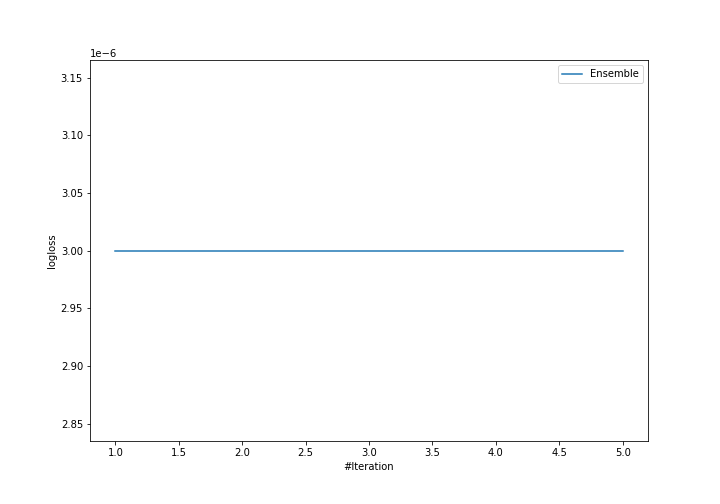
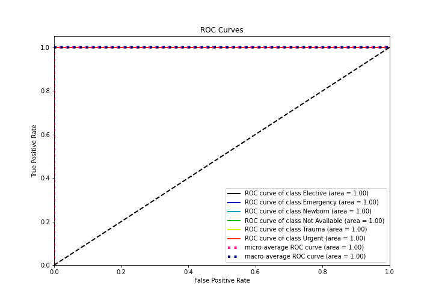

# Summary of Ensemble

[<< Go back](../README.md)

## Ensemble structure
| Model          |   Weight |
|:---------------|---------:|
| 2_DecisionTree |        1 |

### Metric details
|           |   Extreme |   Major |   Minor |   Moderate |   accuracy |   macro avg |   weighted avg |   logloss |
|:----------|----------:|--------:|--------:|-----------:|-----------:|------------:|---------------:|----------:|
| precision |         1 |       1 |       1 |          1 |          1 |           1 |              1 |     3e-06 |
| recall    |         1 |       1 |       1 |          1 |          1 |           1 |              1 |     3e-06 |
| f1-score  |         1 |       1 |       1 |          1 |          1 |           1 |              1 |     3e-06 |
| support   |       220 |     647 |    2634 |        921 |          1 |        4422 |           4422 |     3e-06 |

## Confusion matrix
|                     |   Predicted as Extreme |   Predicted as Major |   Predicted as Minor |   Predicted as Moderate |
|:--------------------|-----------------------:|---------------------:|---------------------:|------------------------:|
| Labeled as Extreme  |                    220 |                    0 |                    0 |                       0 |
| Labeled as Major    |                      0 |                  647 |                    0 |                       0 |
| Labeled as Minor    |                      0 |                    0 |                 2634 |                       0 |
| Labeled as Moderate |                      0 |                    0 |                    0 |                     921 |

## Learning curves

## Confusion Matrix

## Normalized Confusion Matrix

## ROC Curve

## Precision Recall Curve

[<< Go back](../README.md)
