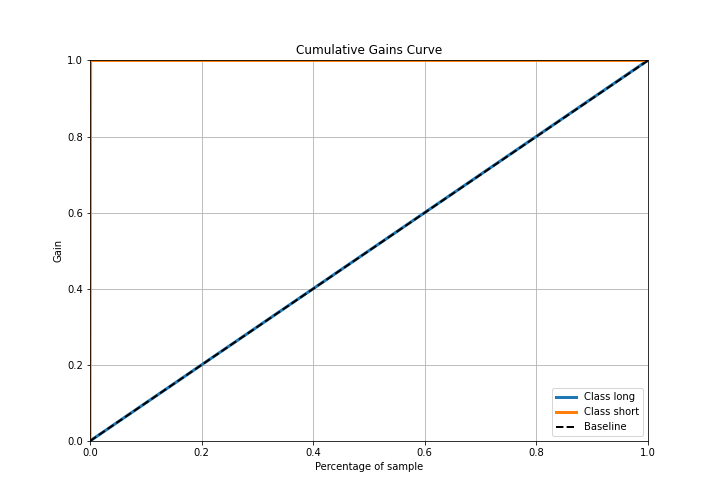

# Summary of 4_Default_NeuralNetwork

[<< Go back](../README.md)

## Neural Network
- **n_jobs**: -1
- **dense_1_size**: 32
- **dense_2_size**: 16
- **learning_rate**: 0.05
- **explain_level**: 2

## Validation
 - **validation_type**: split
 - **train_ratio**: 0.75
 - **shuffle**: True
 - **stratify**: True

## Optimized metric
logloss

## Training time

11.6 seconds

## Metric details
|           |       score |      threshold |
|:----------|------------:|---------------:|
| logloss   | 0.000601284 | nan            |
| auc       | 1           | nan            |
| f1        | 0.263158    |   1.49952e-05  |
| accuracy  | 0.995005    |   1.49952e-05  |
| precision | 0.151515    |   1.49952e-05  |
| recall    | 1           |   1.15568e-174 |
| mcc       | 0.388275    |   1.49952e-05  |

## Metric details with threshold from accuracy metric
|           |       score |     threshold |
|:----------|------------:|--------------:|
| logloss   | 0.000601284 | nan           |
| auc       | 1           | nan           |
| f1        | 0.263158    |   1.49952e-05 |
| accuracy  | 0.995005    |   1.49952e-05 |
| precision | 0.151515    |   1.49952e-05 |
| recall    | 1           |   1.49952e-05 |
| mcc       | 0.388275    |   1.49952e-05 |

## Confusion matrix (at threshold=1.5e-05)
|                  |   Predicted as long |   Predicted as short |
|:-----------------|--------------------:|---------------------:|
| Labeled as long  |                5573 |                   28 |
| Labeled as short |                   0 |                    5 |

## Learning curves

## Permutation-based Importance

## Confusion Matrix

## Normalized Confusion Matrix

## ROC Curve

## Kolmogorov-Smirnov Statistic

## Precision-Recall Curve

## Calibration Curve

## Cumulative Gains Curve

## Lift Curve

[<< Go back](../README.md)
