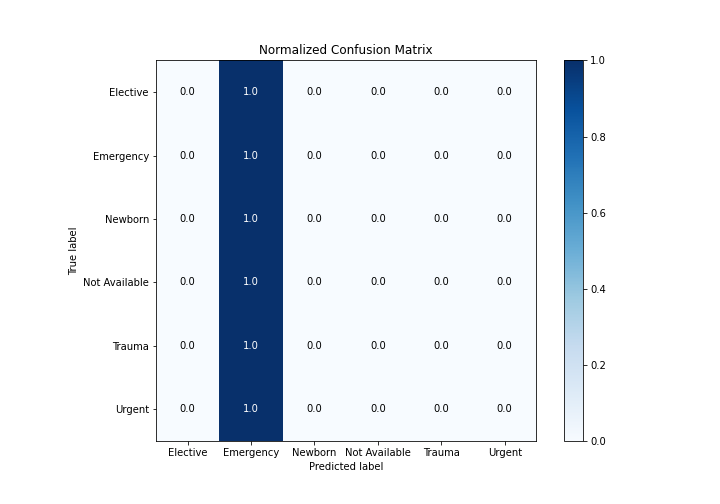

# Summary of 1_Baseline

[<< Go back](../README.md)

## Baseline Classifier (Baseline)
- **n_jobs**: -1
- **num_class**: 6
- **explain_level**: 2

## Validation
 - **validation_type**: split
 - **train_ratio**: 0.75
 - **shuffle**: True
 - **stratify**: True

## Optimized metric
logloss

## Training time

0.8 seconds

### Metric details
|           |   Elective |   Emergency |   Newborn |   Not Available |   Trauma |   Urgent |   accuracy |   macro avg |   weighted avg |   logloss |
|:----------|-----------:|------------:|----------:|----------------:|---------:|---------:|-----------:|------------:|---------------:|----------:|
| precision |          0 |    0.634494 |         0 |               0 |        0 |        0 |   0.634494 |    0.105749 |       0.402582 |   1.04705 |
| recall    |          0 |    1        |         0 |               0 |        0 |        0 |   0.634494 |    0.166667 |       0.634494 |   1.04705 |
| f1-score  |          0 |    0.776379 |         0 |               0 |        0 |        0 |   0.634494 |    0.129397 |       0.492608 |   1.04705 |
| support   |        845 | 2807        |       428 |               5 |       12 |      327 |   0.634494 | 4424        |    4424        |   1.04705 |

## Confusion matrix
|                          |   Predicted as Elective |   Predicted as Emergency |   Predicted as Newborn |   Predicted as Not Available |   Predicted as Trauma |   Predicted as Urgent |
|:-------------------------|------------------------:|-------------------------:|-----------------------:|-----------------------------:|----------------------:|----------------------:|
| Labeled as Elective      |                       0 |                      845 |                      0 |                            0 |                     0 |                     0 |
| Labeled as Emergency     |                       0 |                     2807 |                      0 |                            0 |                     0 |                     0 |
| Labeled as Newborn       |                       0 |                      428 |                      0 |                            0 |                     0 |                     0 |
| Labeled as Not Available |                       0 |                        5 |                      0 |                            0 |                     0 |                     0 |
| Labeled as Trauma        |                       0 |                       12 |                      0 |                            0 |                     0 |                     0 |
| Labeled as Urgent        |                       0 |                      327 |                      0 |                            0 |                     0 |                     0 |

## Learning curves

## Confusion Matrix

## Normalized Confusion Matrix

## ROC Curve

## Precision Recall Curve

[<< Go back](../README.md)
