# Summary of 3_Default_Xgboost

[<< Go back](../README.md)

## Extreme Gradient Boosting (Xgboost)
- **n_jobs**: -1
- **objective**: multi:softprob
- **eta**: 0.075
- **max_depth**: 6
- **min_child_weight**: 1
- **subsample**: 1.0
- **colsample_bytree**: 1.0
- **eval_metric**: mlogloss
- **num_class**: 6
- **explain_level**: 2

## Validation
 - **validation_type**: split
 - **train_ratio**: 0.75
 - **shuffle**: True
 - **stratify**: True

## Optimized metric
logloss

## Training time

30.8 seconds

### Metric details
|           |   Elective |   Emergency |   Newborn |   Not Available |   Trauma |   Urgent |   accuracy |   macro avg |   weighted avg |     logloss |
|:----------|-----------:|------------:|----------:|----------------:|---------:|---------:|-----------:|------------:|---------------:|------------:|
| precision |          1 |           1 |         1 |               1 |        1 |        1 |          1 |           1 |              1 | 0.000281915 |
| recall    |          1 |           1 |         1 |               1 |        1 |        1 |          1 |           1 |              1 | 0.000281915 |
| f1-score  |          1 |           1 |         1 |               1 |        1 |        1 |          1 |           1 |              1 | 0.000281915 |
| support   |        845 |        2807 |       428 |               5 |       12 |      327 |          1 |        4424 |           4424 | 0.000281915 |

## Confusion matrix
|                          |   Predicted as Elective |   Predicted as Emergency |   Predicted as Newborn |   Predicted as Not Available |   Predicted as Trauma |   Predicted as Urgent |
|:-------------------------|------------------------:|-------------------------:|-----------------------:|-----------------------------:|----------------------:|----------------------:|
| Labeled as Elective      |                     845 |                        0 |                      0 |                            0 |                     0 |                     0 |
| Labeled as Emergency     |                       0 |                     2807 |                      0 |                            0 |                     0 |                     0 |
| Labeled as Newborn       |                       0 |                        0 |                    428 |                            0 |                     0 |                     0 |
| Labeled as Not Available |                       0 |                        0 |                      0 |                            5 |                     0 |                     0 |
| Labeled as Trauma        |                       0 |                        0 |                      0 |                            0 |                    12 |                     0 |
| Labeled as Urgent        |                       0 |                        0 |                      0 |                            0 |                     0 |                   327 |

## Learning curves
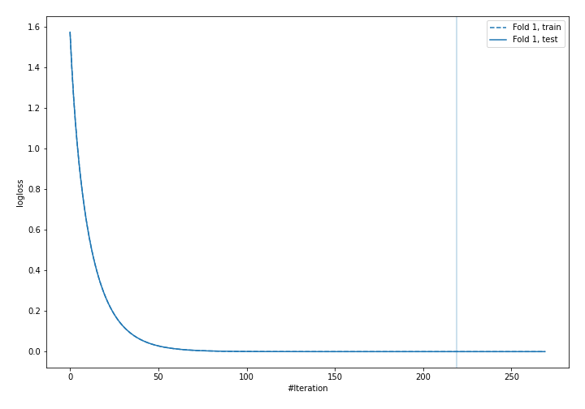

## Permutation-based Importance
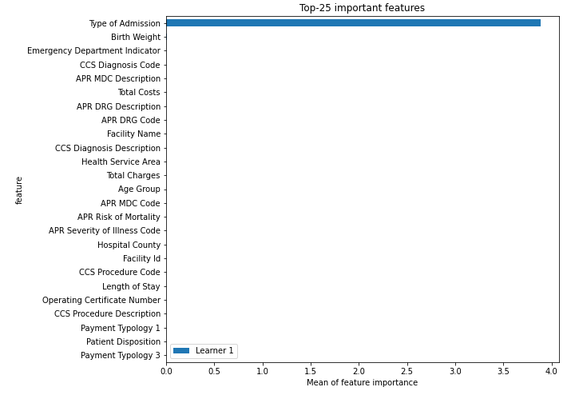
## Confusion Matrix

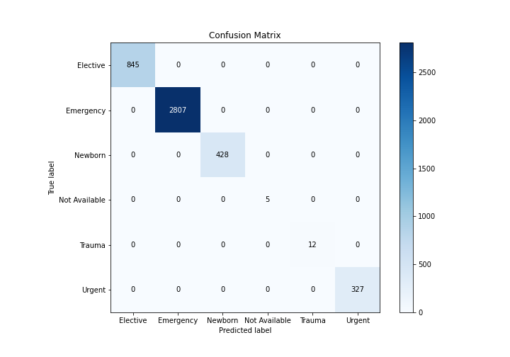

## Normalized Confusion Matrix

## ROC Curve

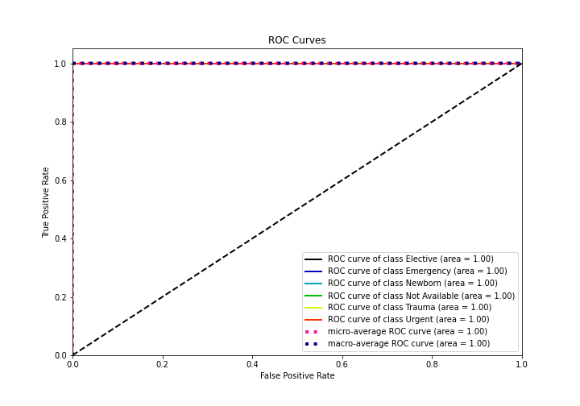

## Precision Recall Curve

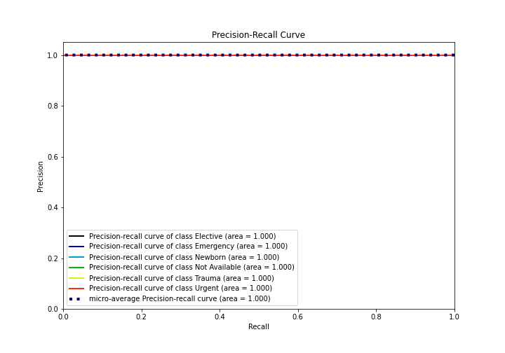

## SHAP Importance
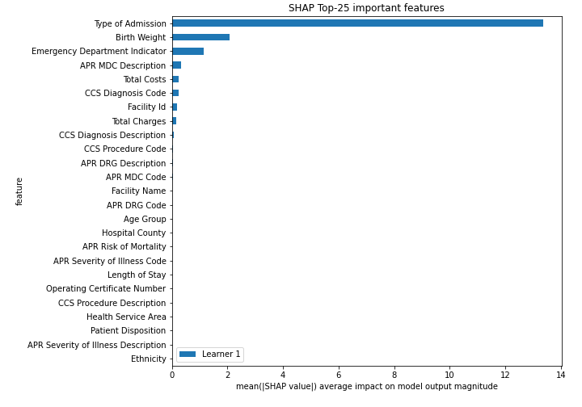

## SHAP Dependence plots

### Dependence Elective (Fold 1)
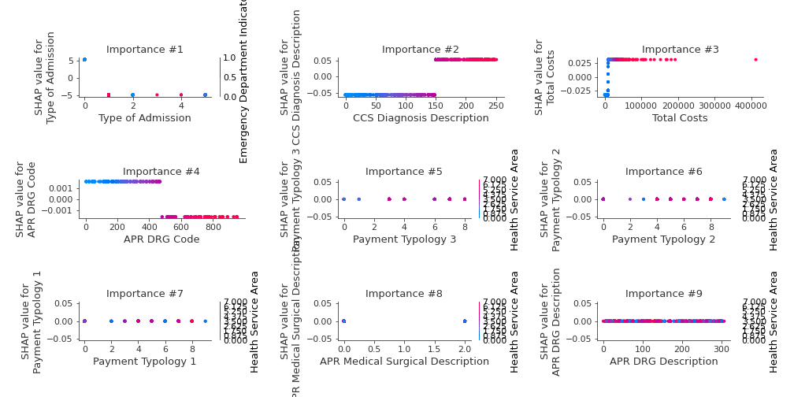
### Dependence Emergency (Fold 1)
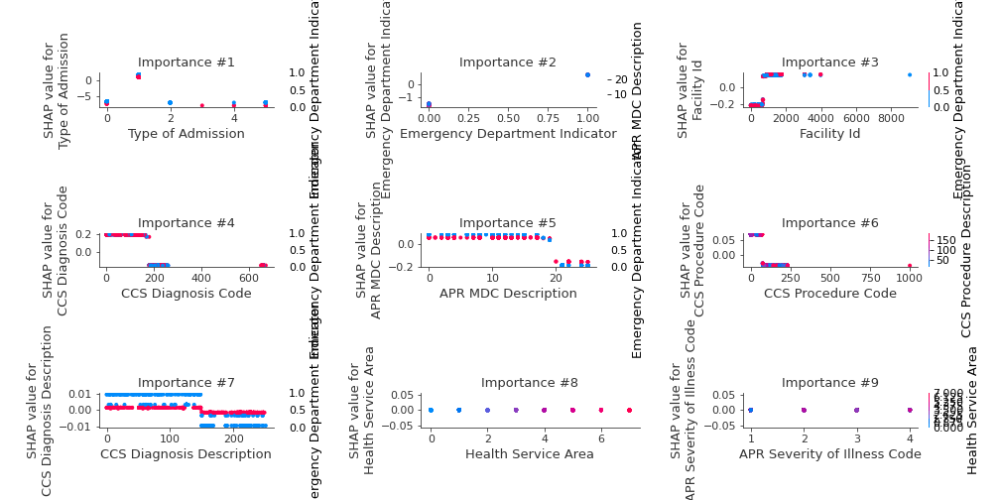
### Dependence Newborn (Fold 1)
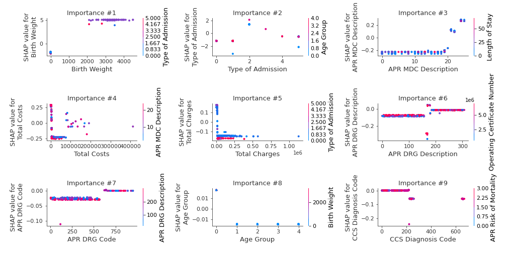
### Dependence Not Available (Fold 1)
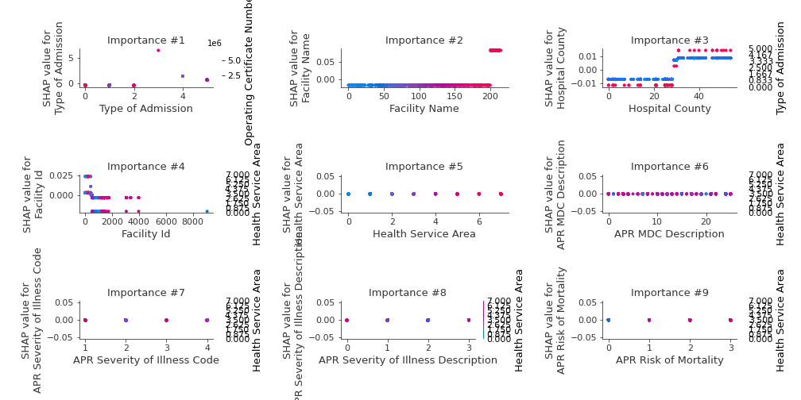
### Dependence Trauma (Fold 1)
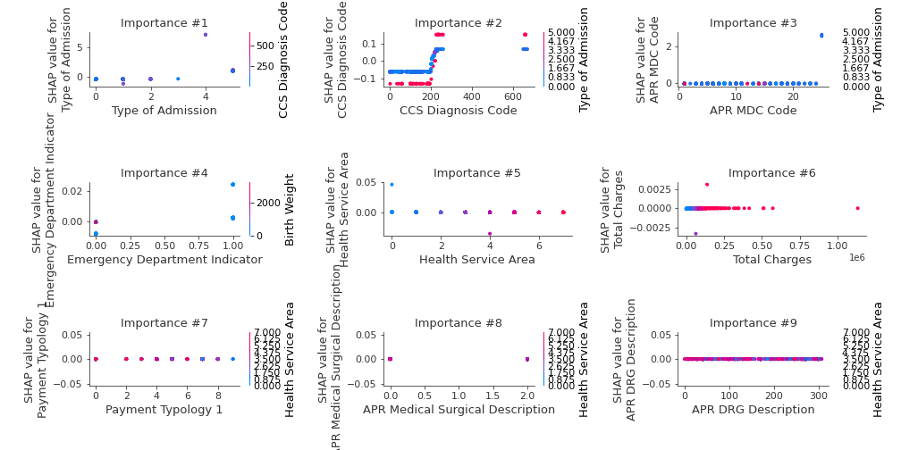
### Dependence Urgent (Fold 1)
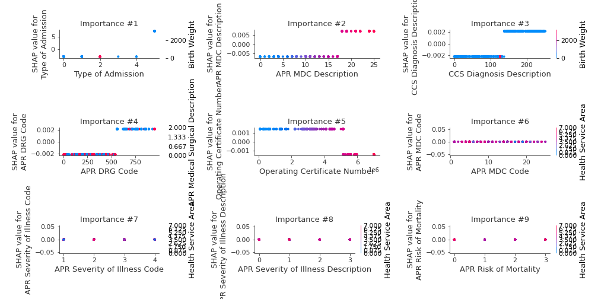

## SHAP Decision plots

### Worst decisions for selected sample 1 (Fold 1)

### Worst decisions for selected sample 2 (Fold 1)
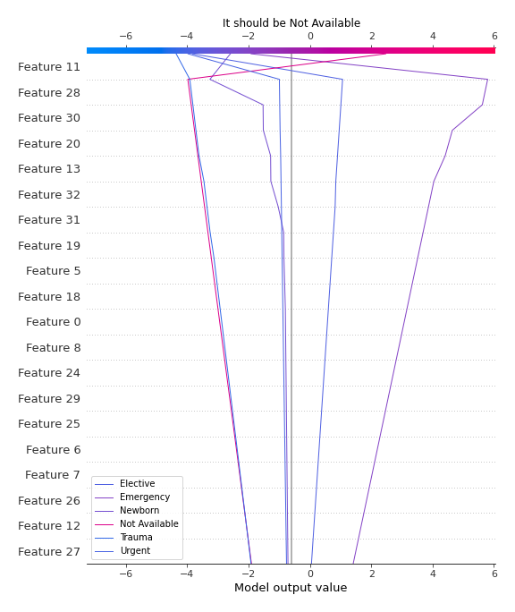
### Worst decisions for selected sample 3 (Fold 1)
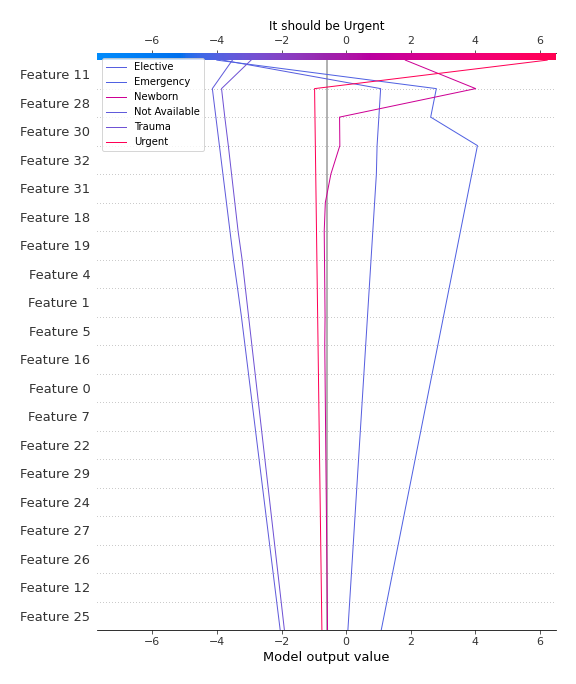
### Worst decisions for selected sample 4 (Fold 1)
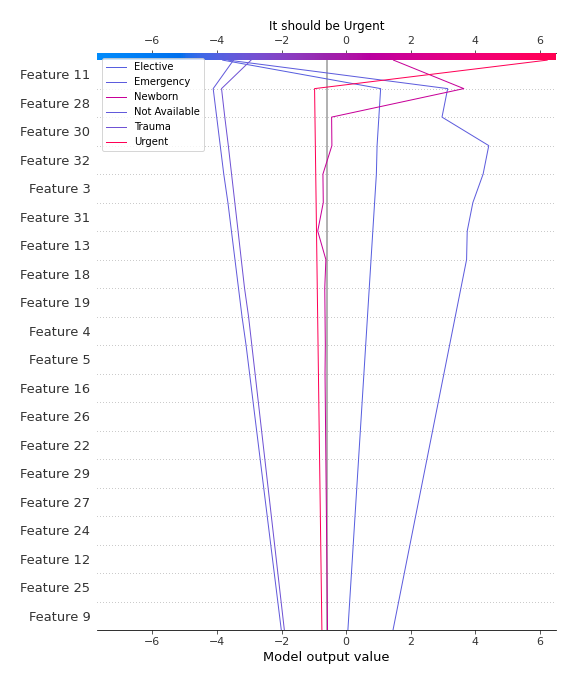
### Best decisions for selected sample 1 (Fold 1)
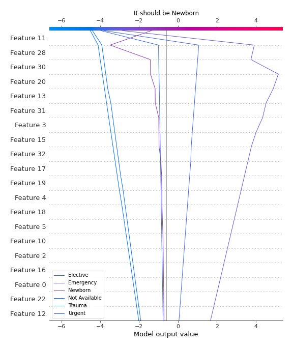
### Best decisions for selected sample 2 (Fold 1)
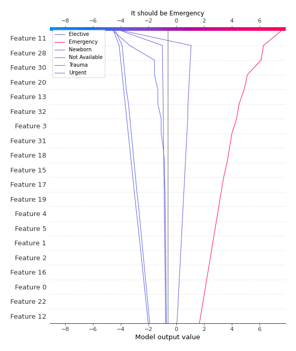
### Best decisions for selected sample 3 (Fold 1)
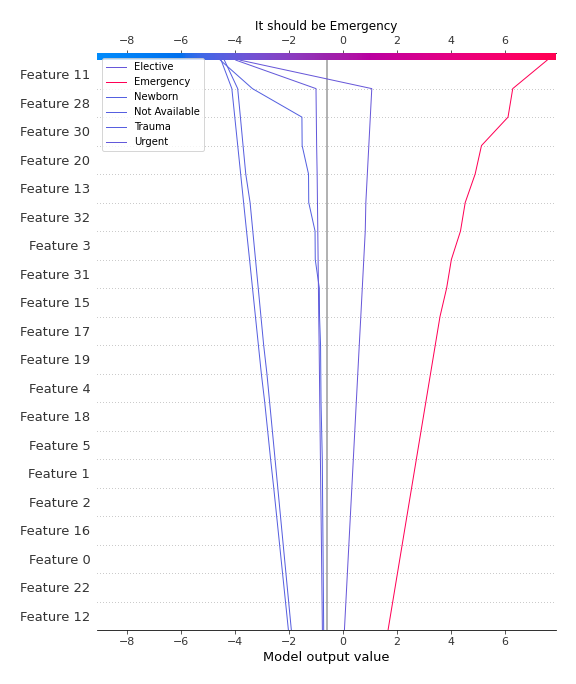
### Best decisions for selected sample 4 (Fold 1)

[<< Go back](../README.md)
