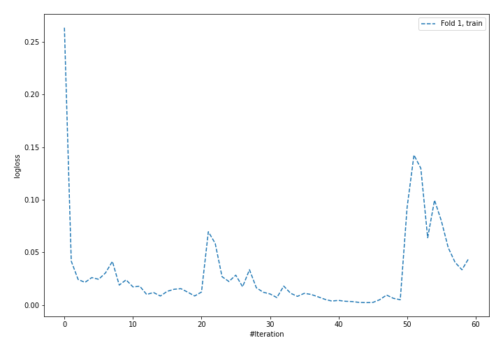
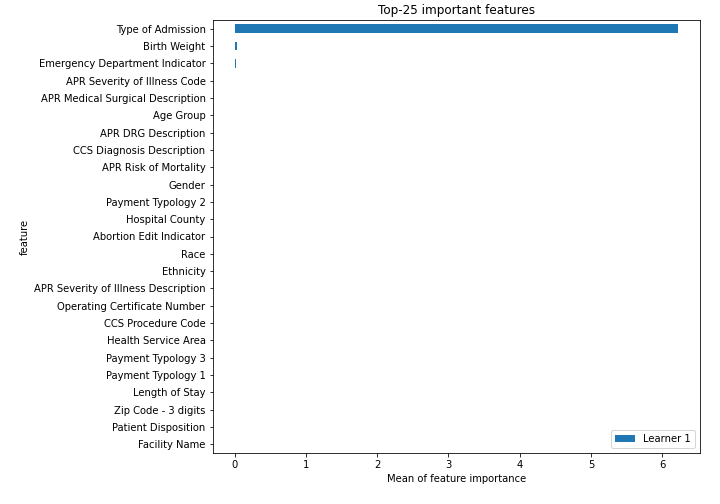
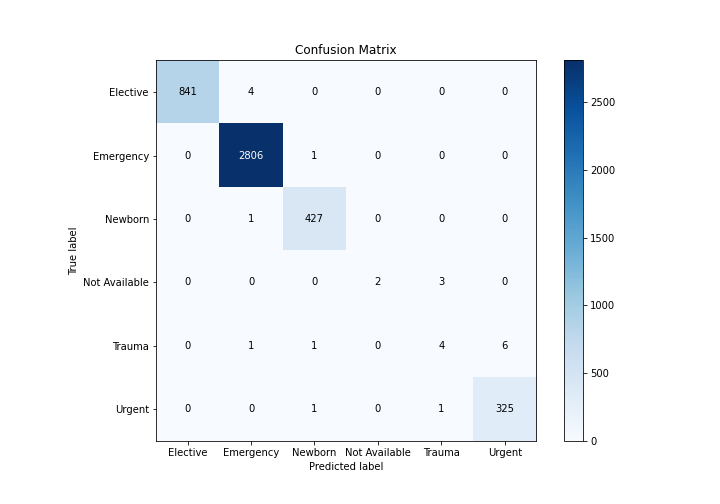
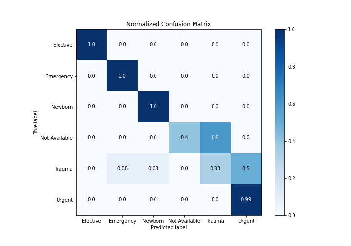
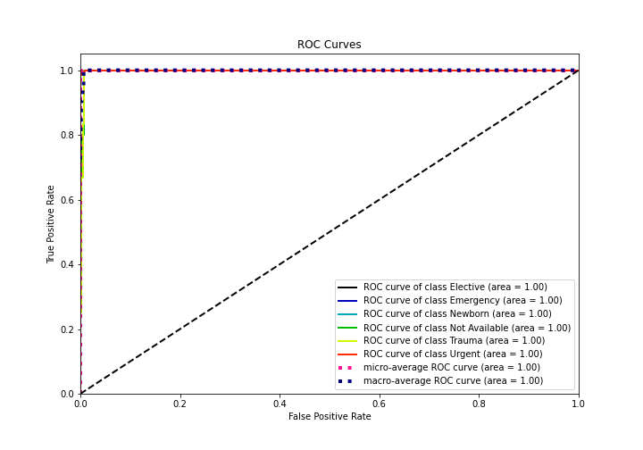
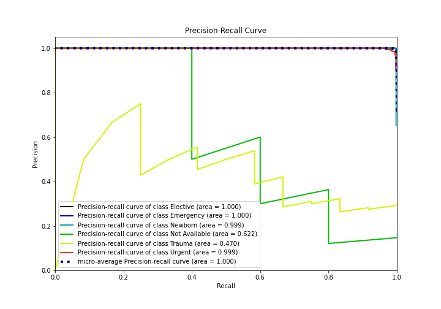

# Summary of 4_Default_NeuralNetwork

[<< Go back](../README.md)

## Neural Network
- **n_jobs**: -1
- **dense_1_size**: 32
- **dense_2_size**: 16
- **learning_rate**: 0.05
- **num_class**: 6
- **explain_level**: 2

## Validation
 - **validation_type**: split
 - **train_ratio**: 0.75
 - **shuffle**: True
 - **stratify**: True

## Optimized metric
logloss

## Training time

11.5 seconds

### Metric details
|           |   Elective |   Emergency |    Newborn |   Not Available |    Trauma |     Urgent |   accuracy |   macro avg |   weighted avg |   logloss |
|:----------|-----------:|------------:|-----------:|----------------:|----------:|-----------:|-----------:|------------:|---------------:|----------:|
| precision |   1        |    0.997866 |   0.993023 |        1        |  0.5      |   0.981873 |   0.995705 |    0.912127 |       0.995275 | 0.0176435 |
| recall    |   0.995266 |    0.999644 |   0.997664 |        0.4      |  0.333333 |   0.993884 |   0.995705 |    0.786632 |       0.995705 | 0.0176435 |
| f1-score  |   0.997628 |    0.998754 |   0.995338 |        0.571429 |  0.4      |   0.987842 |   0.995705 |    0.825165 |       0.995295 | 0.0176435 |
| support   | 845        | 2807        | 428        |        5        | 12        | 327        |   0.995705 | 4424        |    4424        | 0.0176435 |

## Confusion matrix
|                          |   Predicted as Elective |   Predicted as Emergency |   Predicted as Newborn |   Predicted as Not Available |   Predicted as Trauma |   Predicted as Urgent |
|:-------------------------|------------------------:|-------------------------:|-----------------------:|-----------------------------:|----------------------:|----------------------:|
| Labeled as Elective      |                     841 |                        4 |                      0 |                            0 |                     0 |                     0 |
| Labeled as Emergency     |                       0 |                     2806 |                      1 |                            0 |                     0 |                     0 |
| Labeled as Newborn       |                       0 |                        1 |                    427 |                            0 |                     0 |                     0 |
| Labeled as Not Available |                       0 |                        0 |                      0 |                            2 |                     3 |                     0 |
| Labeled as Trauma        |                       0 |                        1 |                      1 |                            0 |                     4 |                     6 |
| Labeled as Urgent        |                       0 |                        0 |                      1 |                            0 |                     1 |                   325 |

## Learning curves

## Permutation-based Importance

## Confusion Matrix

## Normalized Confusion Matrix

## ROC Curve

## Precision Recall Curve

[<< Go back](../README.md)
