# Summary of 5_Default_RandomForest

[<< Go back](../README.md)

## Random Forest
- **n_jobs**: -1
- **criterion**: gini
- **max_features**: 0.9
- **min_samples_split**: 30
- **max_depth**: 4
- **eval_metric_name**: logloss
- **num_class**: 6
- **explain_level**: 2

## Validation
 - **validation_type**: split
 - **train_ratio**: 0.75
 - **shuffle**: True
 - **stratify**: True

## Optimized metric
logloss

## Training time

31.8 seconds

### Metric details
|           |   Elective |   Emergency |   Newborn |   Not Available |    Trauma |   Urgent |   accuracy |   macro avg |   weighted avg |    logloss |
|:----------|-----------:|------------:|----------:|----------------:|----------:|---------:|-----------:|------------:|---------------:|-----------:|
| precision |          1 |           1 |         1 |               0 |  0.705882 |        1 |    0.99887 |    0.784314 |       0.998072 | 0.00309481 |
| recall    |          1 |           1 |         1 |               0 |  1        |        1 |    0.99887 |    0.833333 |       0.99887  | 0.00309481 |
| f1-score  |          1 |           1 |         1 |               0 |  0.827586 |        1 |    0.99887 |    0.804598 |       0.998402 | 0.00309481 |
| support   |        845 |        2807 |       428 |               5 | 12        |      327 |    0.99887 | 4424        |    4424        | 0.00309481 |

## Confusion matrix
|                          |   Predicted as Elective |   Predicted as Emergency |   Predicted as Newborn |   Predicted as Not Available |   Predicted as Trauma |   Predicted as Urgent |
|:-------------------------|------------------------:|-------------------------:|-----------------------:|-----------------------------:|----------------------:|----------------------:|
| Labeled as Elective      |                     845 |                        0 |                      0 |                            0 |                     0 |                     0 |
| Labeled as Emergency     |                       0 |                     2807 |                      0 |                            0 |                     0 |                     0 |
| Labeled as Newborn       |                       0 |                        0 |                    428 |                            0 |                     0 |                     0 |
| Labeled as Not Available |                       0 |                        0 |                      0 |                            0 |                     5 |                     0 |
| Labeled as Trauma        |                       0 |                        0 |                      0 |                            0 |                    12 |                     0 |
| Labeled as Urgent        |                       0 |                        0 |                      0 |                            0 |                     0 |                   327 |

## Learning curves
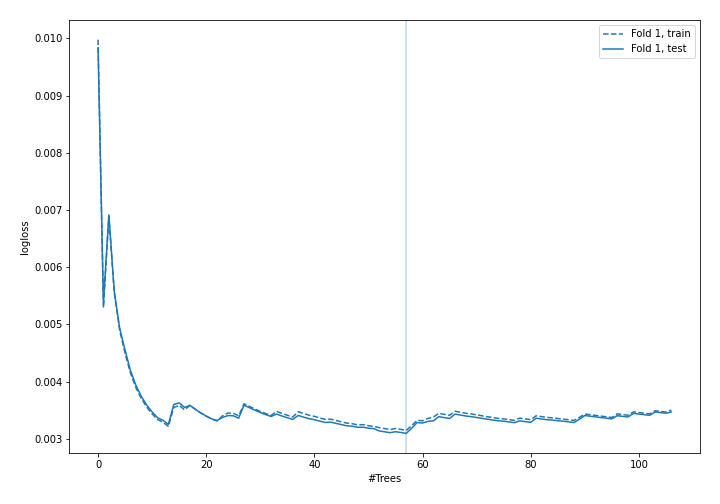

## Permutation-based Importance
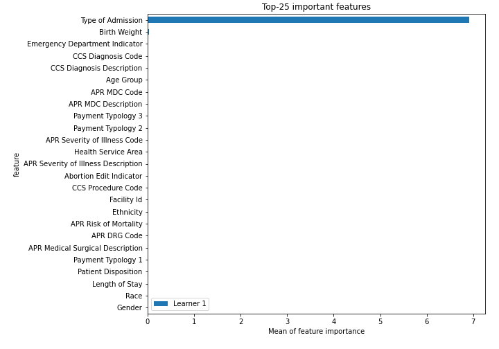
## Confusion Matrix

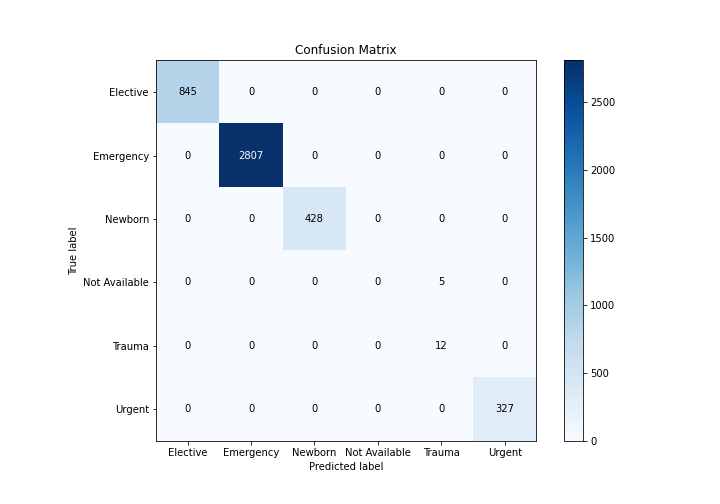

## Normalized Confusion Matrix

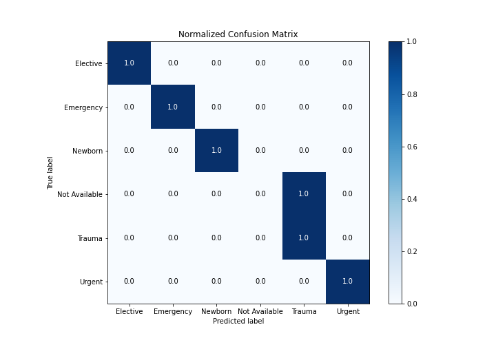

## ROC Curve

## Precision Recall Curve

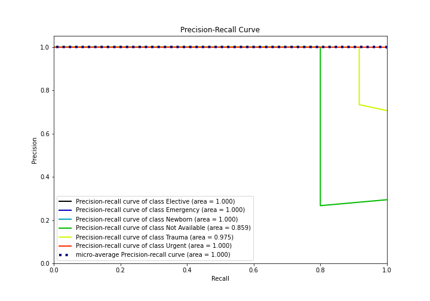

## SHAP Importance
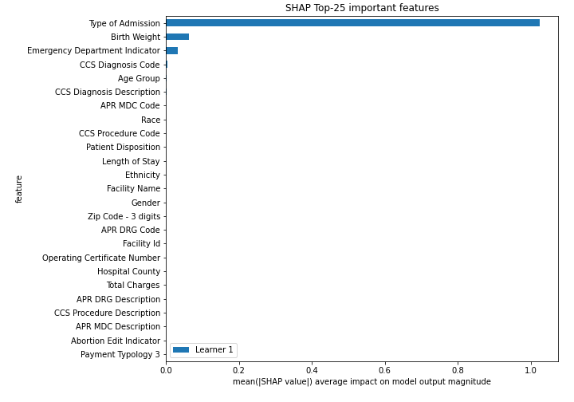

## SHAP Dependence plots

### Dependence Elective (Fold 1)
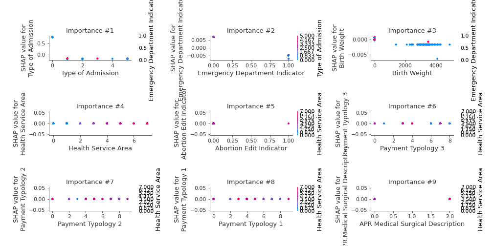
### Dependence Emergency (Fold 1)
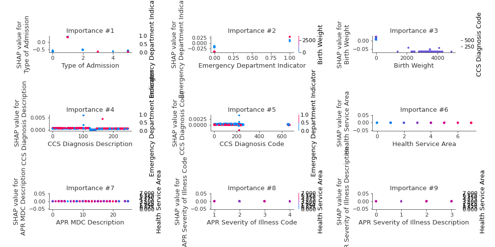
### Dependence Newborn (Fold 1)
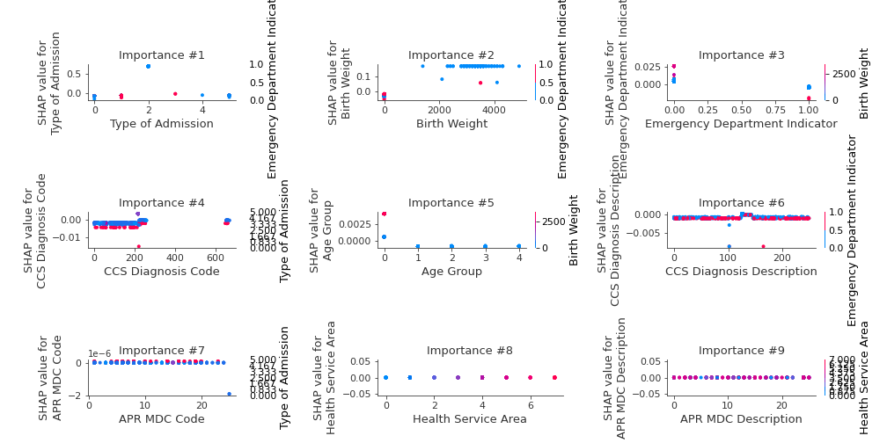
### Dependence Not Available (Fold 1)

### Dependence Trauma (Fold 1)
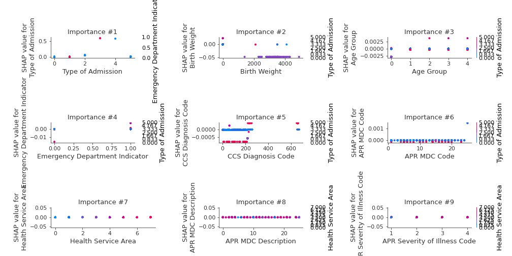
### Dependence Urgent (Fold 1)
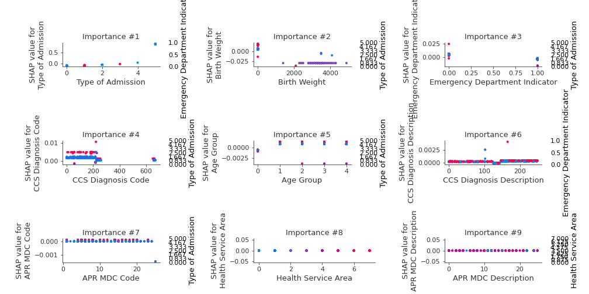

## SHAP Decision plots

### Worst decisions for selected sample 1 (Fold 1)

### Worst decisions for selected sample 2 (Fold 1)

### Worst decisions for selected sample 3 (Fold 1)

### Worst decisions for selected sample 4 (Fold 1)
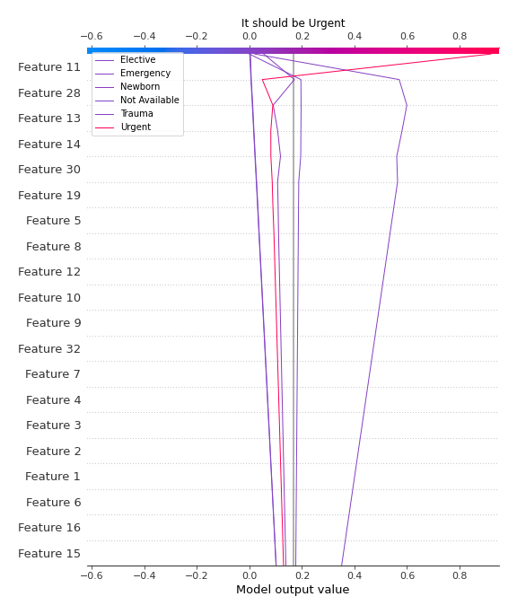
### Best decisions for selected sample 1 (Fold 1)
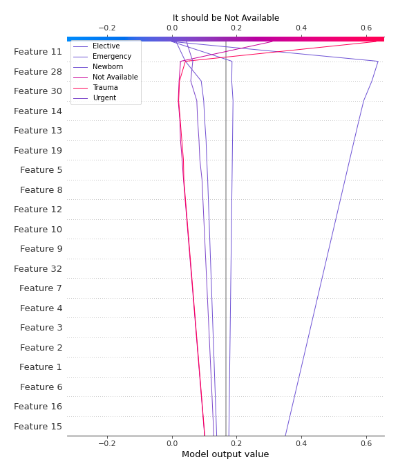
### Best decisions for selected sample 2 (Fold 1)

### Best decisions for selected sample 3 (Fold 1)
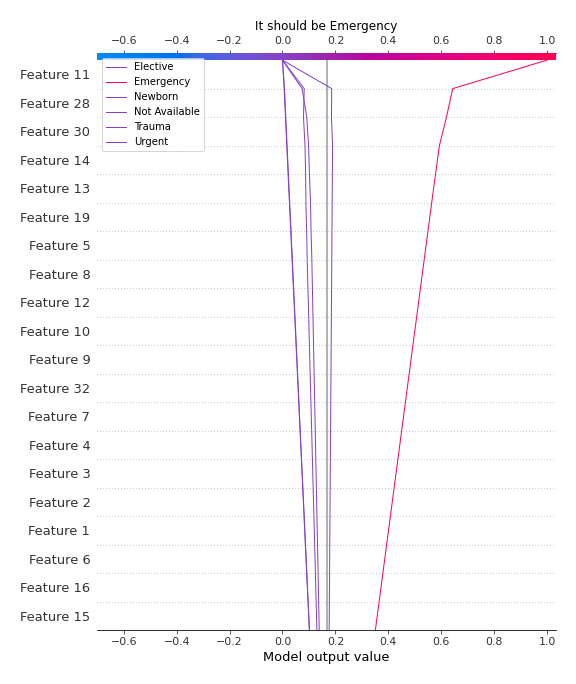
### Best decisions for selected sample 4 (Fold 1)

[<< Go back](../README.md)
