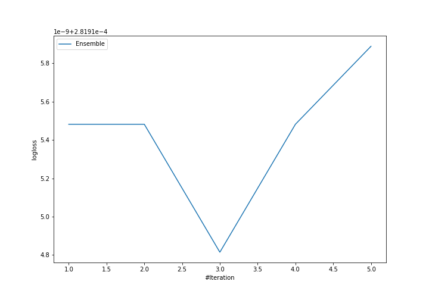
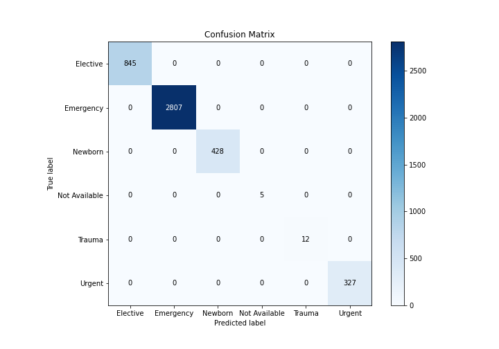
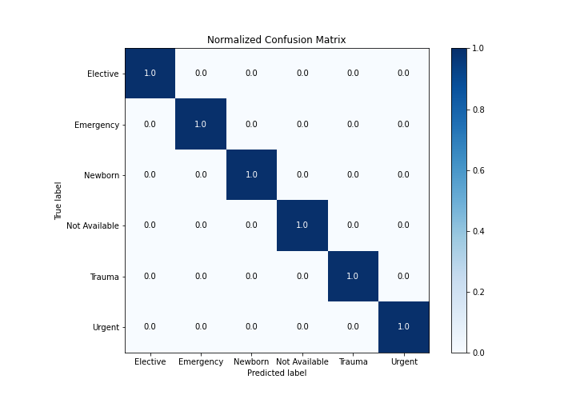
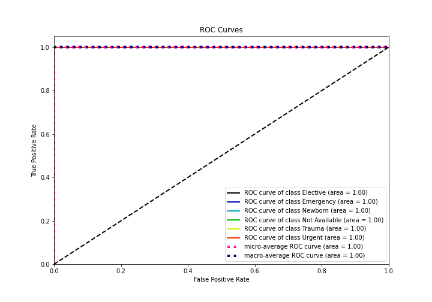
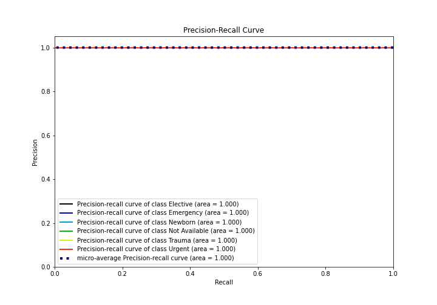

# Summary of Ensemble

[<< Go back](../README.md)

## Ensemble structure
| Model             |   Weight |
|:------------------|---------:|
| 3_Default_Xgboost |        3 |

### Metric details
|           |   Elective |   Emergency |   Newborn |   Not Available |   Trauma |   Urgent |   accuracy |   macro avg |   weighted avg |     logloss |
|:----------|-----------:|------------:|----------:|----------------:|---------:|---------:|-----------:|------------:|---------------:|------------:|
| precision |          1 |           1 |         1 |               1 |        1 |        1 |          1 |           1 |              1 | 0.000281915 |
| recall    |          1 |           1 |         1 |               1 |        1 |        1 |          1 |           1 |              1 | 0.000281915 |
| f1-score  |          1 |           1 |         1 |               1 |        1 |        1 |          1 |           1 |              1 | 0.000281915 |
| support   |        845 |        2807 |       428 |               5 |       12 |      327 |          1 |        4424 |           4424 | 0.000281915 |

## Confusion matrix
|                          |   Predicted as Elective |   Predicted as Emergency |   Predicted as Newborn |   Predicted as Not Available |   Predicted as Trauma |   Predicted as Urgent |
|:-------------------------|------------------------:|-------------------------:|-----------------------:|-----------------------------:|----------------------:|----------------------:|
| Labeled as Elective      |                     845 |                        0 |                      0 |                            0 |                     0 |                     0 |
| Labeled as Emergency     |                       0 |                     2807 |                      0 |                            0 |                     0 |                     0 |
| Labeled as Newborn       |                       0 |                        0 |                    428 |                            0 |                     0 |                     0 |
| Labeled as Not Available |                       0 |                        0 |                      0 |                            5 |                     0 |                     0 |
| Labeled as Trauma        |                       0 |                        0 |                      0 |                            0 |                    12 |                     0 |
| Labeled as Urgent        |                       0 |                        0 |                      0 |                            0 |                     0 |                   327 |

## Learning curves

## Confusion Matrix

## Normalized Confusion Matrix

## ROC Curve

## Precision Recall Curve

[<< Go back](../README.md)
