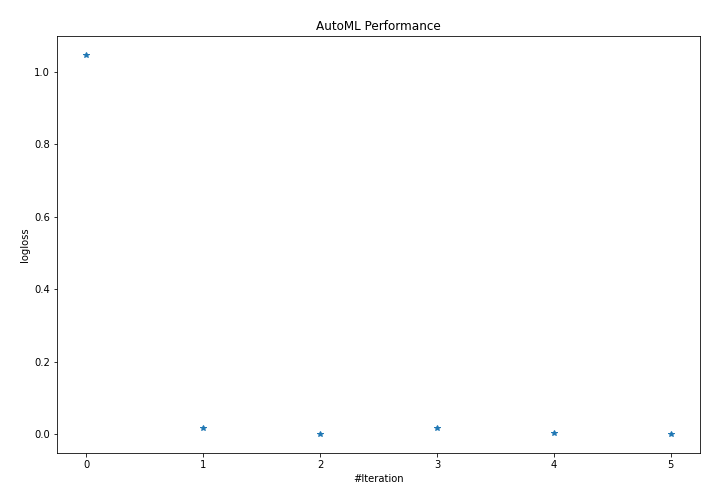
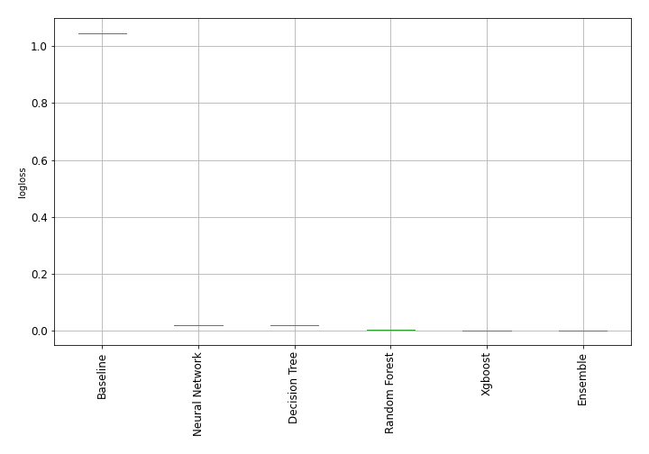
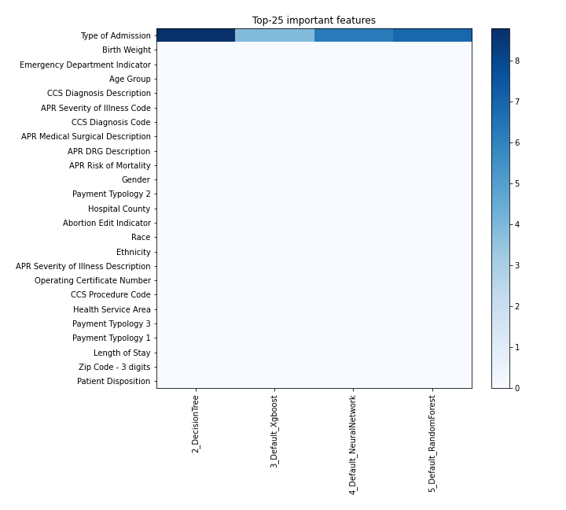

# AutoML Leaderboard

| Best model   | name                                                         | model_type     | metric_type   |   metric_value |   train_time |
|:-------------|:-------------------------------------------------------------|:---------------|:--------------|---------------:|-------------:|
|              | [1_Baseline](1_Baseline/README.md)                           | Baseline       | logloss       |    1.04705     |         1.49 |
|              | [2_DecisionTree](2_DecisionTree/README.md)                   | Decision Tree  | logloss       |    0.0176364   |        26.92 |
| **the best** | [3_Default_Xgboost](3_Default_Xgboost/README.md)             | Xgboost        | logloss       |    0.000281915 |        32.04 |
|              | [4_Default_NeuralNetwork](4_Default_NeuralNetwork/README.md) | Neural Network | logloss       |    0.0176435   |        12.45 |
|              | [5_Default_RandomForest](5_Default_RandomForest/README.md)   | Random Forest  | logloss       |    0.00309481  |        33.2  |
|              | [Ensemble](Ensemble/README.md)                               | Ensemble       | logloss       |    0.000281915 |         0.81 |

### AutoML Performance

### AutoML Performance Boxplot

### Features Importance

### Spearman Correlation of Models

