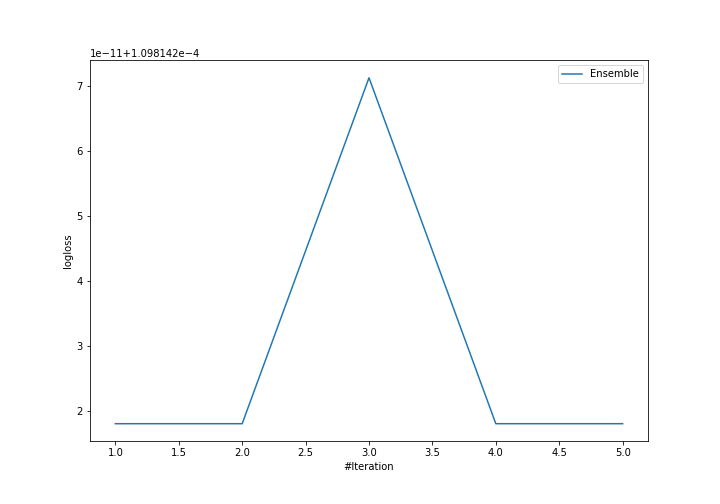
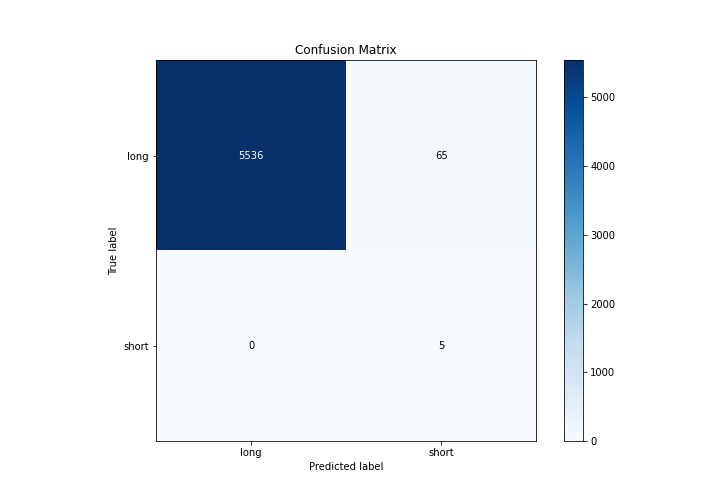
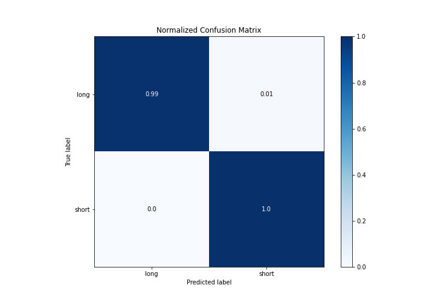
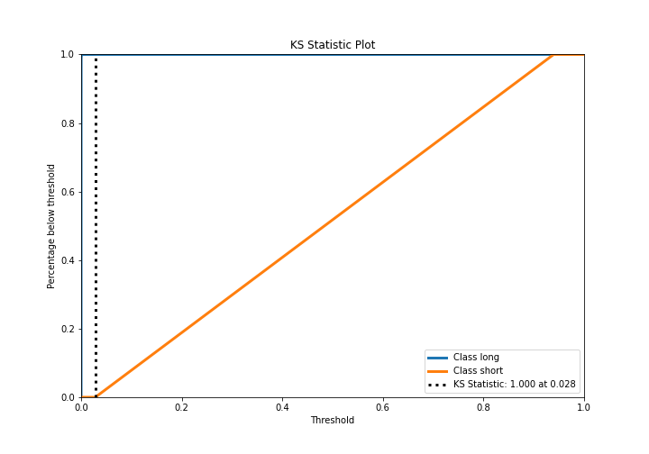
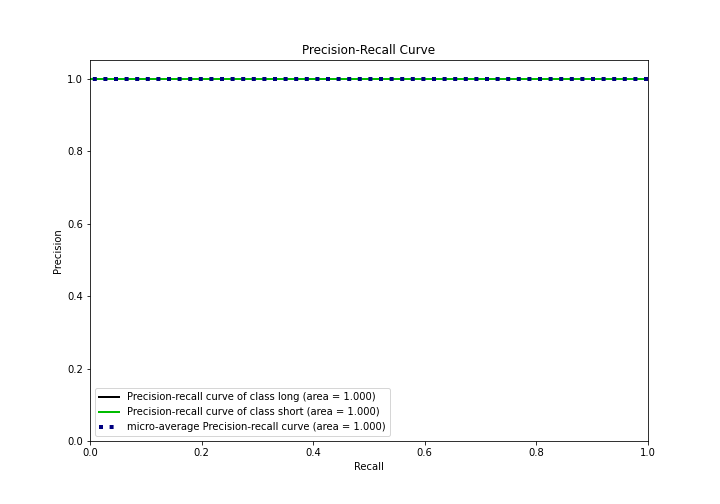
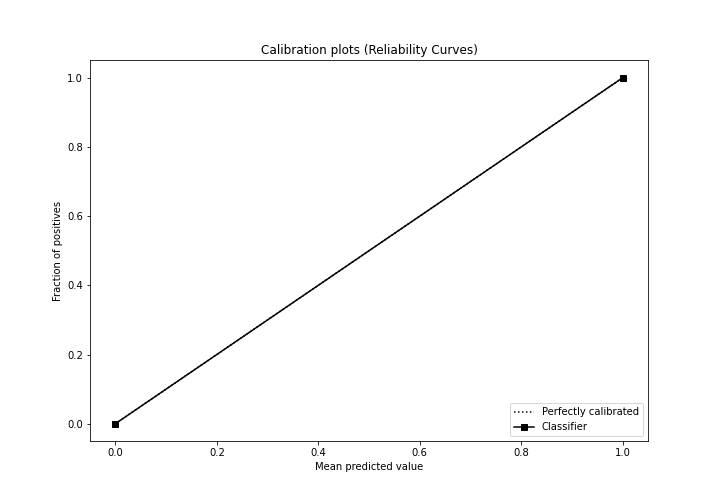
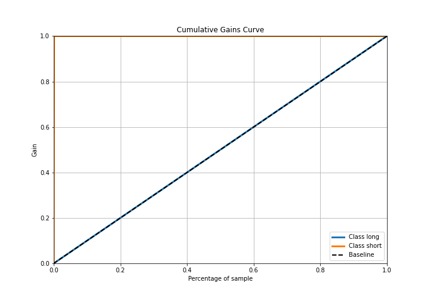
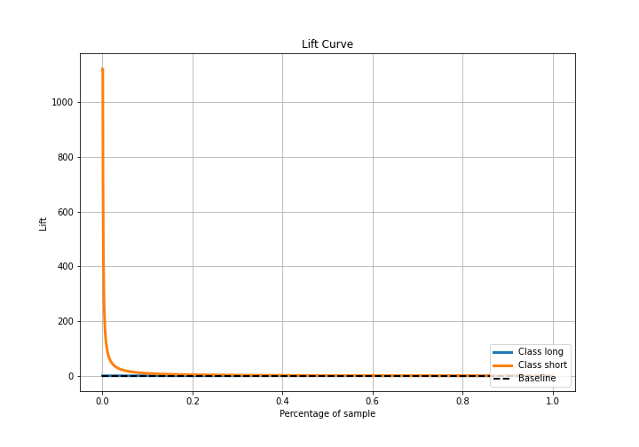

# Summary of Ensemble

[<< Go back](../README.md)

## Ensemble structure
| Model             |   Weight |
|:------------------|---------:|
| 3_Default_Xgboost |        1 |

## Metric details
|           |       score |     threshold |
|:----------|------------:|--------------:|
| logloss   | 0.000109814 | nan           |
| auc       | 1           | nan           |
| f1        | 0.133333    |   0.000187796 |
| accuracy  | 0.988405    |   0.000187796 |
| precision | 0.0714286   |   0.000187796 |
| recall    | 1           |   2.82334e-05 |
| mcc       | 0.265706    |   0.000187796 |

## Metric details with threshold from accuracy metric
|           |       score |     threshold |
|:----------|------------:|--------------:|
| logloss   | 0.000109814 | nan           |
| auc       | 1           | nan           |
| f1        | 0.133333    |   0.000187796 |
| accuracy  | 0.988405    |   0.000187796 |
| precision | 0.0714286   |   0.000187796 |
| recall    | 1           |   0.000187796 |
| mcc       | 0.265706    |   0.000187796 |

## Confusion matrix (at threshold=0.000188)
|                  |   Predicted as long |   Predicted as short |
|:-----------------|--------------------:|---------------------:|
| Labeled as long  |                5536 |                   65 |
| Labeled as short |                   0 |                    5 |

## Learning curves

## Confusion Matrix

## Normalized Confusion Matrix

## ROC Curve

## Kolmogorov-Smirnov Statistic

## Precision-Recall Curve

## Calibration Curve

## Cumulative Gains Curve

## Lift Curve

[<< Go back](../README.md)
